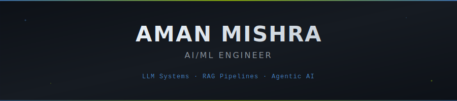
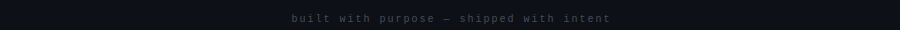

  

<pre>
<code style="color: #EAEAEA">
> ./init_sequence.sh --user=aman --role=auth
> ACCESS GRANTED. LOADING NEURAL PROFILE...

> <strong>IDENTITY:</strong>      Aman (@questinrest)
> <strong>ARCHETYPE:</strong>     AI Engineer @ Observo // MSc Data Science
> <strong>PREV_LOC:</strong>      Ex-Confedo AI // Ex-USG Lab IIITD
> <strong>DIRECTIVE:</strong>     "Maths + Code"
> <strong>STATUS:</strong>        Constructing agents, destroying latency.
</code>
</pre>

<table width="100%" style="border: 1px solid #333; background-color: #050505;">
  <tr>
    <td width="50%" valign="top" style="border: 1px solid #333; padding: 20px;">
      <h3 style="margin-top: 0;">/// TRANSMISSION: InSight</h3>
      

        Weekly intelligence dump on AI Engineering and Architecture.
      

       
      <a href="https://linkedin.com">
        <code>
        [  SUBSCRIBE_FEED  ]
        [  >>>> EXECUTE    ]
        </code>
      </a>
    </td>
    <td width="50%" valign="top" style="border: 1px solid #333; padding: 20px;">
      <h3 style="margin-top: 0;">/// WEAPONRY</h3>
      
      
       
      
      
       
      
    </td>
  </tr>
  <tr>
    <td width="50%" valign="top" style="border: 1px solid #333; padding: 20px;">
      <h3 style="margin-top: 0;">/// R&D_LOGS</h3>
      <ul style="list-style-type: none; padding: 0; font-family: monospace;">
        <li>[x] Machine Unlearning</li>
        <li>[x] Agent Evaluation</li>
        <li>[!] Observability</li>
      </ul>
    </td>
    <td width="50%" valign="top" style="border: 1px solid #333; padding: 20px;">
      <h3 style="margin-top: 0;">/// UPLINK</h3>
      <pre style="background: #000; border: none; padding: 0; margin: 0;">
{
  "mail": "<a href="mailto:am30435@gmail.com">am30435@gmail.com</a>",
  "link": "<a href="#">linkedin_node</a>",
  "state": "open_to_work"
}
      </pre>
    </td>
  </tr>
</table>

  

